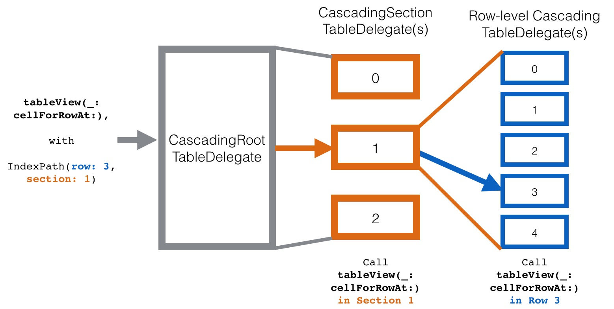
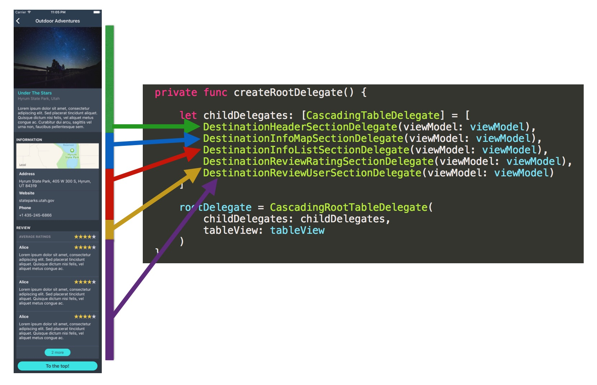

# CascadingTableDelegate

[](https://travis-ci.org/edopelawi/CascadingTableDelegate) 
[](https://swift.org)
[](http://cocoapods.org/pods/CascadingTableDelegate)

[](http://cocoapods.org/pods/CascadingTableDelegate)
[](https://github.com/Carthage/Carthage)
[](http://cocoapods.org/pods/CascadingTableDelegate)

**A no-nonsense way to write cleaner `UITableViewDelegate` and `UITableViewDataSource`.**


## Why is this library made?

In common iOS development, `UITableView` has became the bread and butter for building a rich, large pages. This page, for example:


(Kudos to [Wieky](https://id.linkedin.com/in/wiekyazza) for helping me creating this sample page's design! 😁)

Still, using `UITableView` has its own problems.

As you know, to display the contents, `UITableView` uses `UITableViewDelegate` and `UITableViewDataSource`- compliant objects. This often became the cause of my headache since `UITableView` **only allows one object** to become the `delegate` and `dataSource`. These limitations might led to an unnecessarily huge source code file - a know-it-all [Megamoth method](https://blog.codinghorror.com/new-programming-jargon/). Some common victims of this problems are `tableView(_:cellForRowAtIndexPath:)`, `tableView(_:heightForRowAtIndexPath)`, and `tableView(_:didSelectRowAtIndexPath:)`. 

Because of this, there are times when I thought it be nice if **we could split** the `delegate` and `dataSource` method calls **into each section or row.**

# Meet CascadingTableDelegate.

`CascadingTableDelegate` is an approach to break down `UITableViewDelegate` and `UITableViewDataSource` into tree structure, inspired by the [Composite pattern](https://en.wikipedia.org/wiki/Composite_pattern). Here's the simplified structure of the protocol (with less documentation):

```swift

public protocol CascadingTableDelegate: UITableViewDataSource, UITableViewDelegate {
	
	/// Index of this instance in its parent's `childDelegates`. Will be set by the parent.
	var index: Int { get set }
	
	/// Array of child `CascadingTableDelegate` instances.
	var childDelegates: [CascadingTableDelegate] { get set }
	
	/// Weak reference to this instance's parent `CascadingTableDelegate`.		
	weak var parentDelegate: CascadingTableDelegate? { get set }
	
	/**
	Base initializer for this instance.
	
	- parameter index:          `index` value for this instance. May be changed later, including this instance's `parentDelegate`.
	- parameter childDelegates: Array of child `CascadingTableDelegate`s.
	
	- returns: This class' instance.
	*/
	init(index: Int, childDelegates: [CascadingTableDelegate])
	
	/**
	Preparation method that will be called by this instance's parent, normally in the first time.
	
	- note: This method could be used for a wide range of purposes, e.g. registering table view cells.
	- note: If this called manually, it should call this instance child's `prepare(tableView:)` method.
	
	- parameter tableView: `UITableView` instance.
	*/
	func prepare(tableView tableView: UITableView)
}

```

Long story short, this protocol allows us to propagate any `UITableViewDelegate` or `UITableViewDataSource` method call it receives to its child, based on the `section` or `row` value of the passed `NSIndexPath`.

###But UITableViewDelegate and UITableViewDataSource has tons of methods! Who will propagate all those calls?

Worry not, we already done the heavy lifting by creating **two ready-to-use classes**, `CascadingRootTableDelegate` and `CascadingSectionTableDelegate`. Both implements `CascasdingTableDelegate` protocol and the propagating logic, but with different use case:

- `CascadingRootTableDelegate`:
	- 	Acts as main `UITableViewDelegate` and `UITableViewDataSource` for the `UITableView`.
	-  Propagates **almost** all of delegate and dataSource calls to its `childDelegates`, based on `section` value of the passed `NSIndexPath` and the child's `index`.
	-  Returns number of its `childDelegates` for `numberOfSectionsInTableView(_:)` call.

	
-  `CascadingSectionTableDelegate`:
	-  	Does not sets itself as `UITableViewDelegate` and `UITableViewDataSource` of the passed `UITableView`, but waits for its `parentDelegate` calls.
	-  Just like `CascadingRootTableDelegate`, it also propagates **almost** all of delegate and dataSource calls to its `childDelegates`, but based by the `row` of passed `NSIndexPath`.
	-  Returns number of its `childDelegates` for `tableView(_:numberOfRowsInSection:)` call.
	
Here's a diagram to potray how a `tableView(_:cellForRowAtIndexPath:)` call works to those classes:





Both classes also accepts your custom implementations of `CascadingTableDelegate` (which is only `UITableViewDataSource` and `UITableViewDelegate` with few new properties and methods, really) as their `childDelegates`. Plus, you could subclass any of them and call `super` on the overriden methods to let them do the propagation - [Chain-of-responsibility](https://en.wikipedia.org/wiki/Chain-of-responsibility_pattern)-esque style 😉

Here's a snippet how the long page above is divided into section delegates in the sample code:



All the section delegate classes then added as child to a single `CascadingRootTableDelegate`. For the details, just clone this repo and run the sample project! 😁

## Pros and Cons

### Pros

With CascadingTableDelegate, we could:

- Break down `UITableViewDataSource` and `UITableViewDelegate` methods to each section or row, resulting to cleaner, well separated code.
- Use the familiar `UITableViewDataSource` and `UITableViewDelegate` methods that we have been used all along, allowing easier migrations for the old code.

Other pros:

- **All implemented methods** on `CascadingRootTableDelegate` and `CascadingSectionTableDelegate` are unit tested! To run the tests, you could:
	-  Open the sample project and run the available tests, or
	-  Execute `run_tests.sh` in your terminal.
- This library is available through Cocoapods and Carthage! 😉


### Cons

#### 1. Unpropagated special methods

As you know, not all `UITableViewDelegate` methods uses single `NSIndexPath` as their parameter, which makes propagating their calls less intuitive. Based on this reasoning, `CascadingRootTableDelegate` and `CascadingSectionTableDelegate` doesn't implement these `UITableViewDelegate` methods:

 - `sectionIndexTitlesForTableView(_:)`
 - `tableView(_:sectionForSectionIndexTitle:atIndex:)`
 - `tableView(_:moveRowAtIndexPath:toIndexPath:)`
 - `tableView(_:shouldUpdateFocusInContext:)`
 - `tableView(_:didUpdateFocusInContext: withAnimationCoordinator:)`
 - `indexPathForPreferredFocusedViewInTableView(_:)`
 - `tableView(_:targetIndexPathForMoveFromRowAtIndexPath: toProposedIndexPath:)`

 Should you need to implement any of those, feel free to subclass both of them and add your own implementations! 😁
 
#### 2. `tableView(_:estimatedHeightFor...:)` method handlings
 
There are three optional `UITableViewDelegate` methods that used to estimate heights:

- `tableView(_:estimatedHeightForRowAtIndexPath:)`,
- `tableView(_:estimatedHeightForHeaderInSection:)`, and
- `tableView(_:estimatedHeightForFooterInSection:)`.

`CascadingRootTableDelegate` and `CascadingSectionTableDelegate` implements those calls for propagating it to the `childDelegates`. And since both of them implements those, the `UITableView` will **always** call those methods when rendering its rows, headers, and footers.

To prevent layout breaks, `CascadingRootTableDelegate` and `CascadingSectionTableDelegate` will call its childDelegate's `tableView(_:heightFor...:)` counterpart, so the `UITableView` will render it correctly. If your `tableView(_:heightFor...:)` methods use heavy calculations, it is advised to implement the `tableView(_:estimatedHeightFor...:)` counterpart of them.

Should both method not implemented by the `childDelegate`, `CascadingRootTableDelegate` and `CascadingSectionTableDelegate` will return `UITableViewAutomaticDimension` for `tableView(_:estimatedHeightForRowAtIndexPath:)`, and `0` for `tableView(_:estimatedHeightForHeaderInSection:)`, and `tableView(_:estimatedHeightForFooterInSection:)`.
 
For details of all method return values, please refer to the [Default Return Value documentation](Documentation/DefaultReturnValues.md).

#### 3. `weak` declaration for `parentDelegate`

Somehow, Xcode won't add `weak` modifier when you're implementing your own `CascadingTableDelegate` and autocompleting the `parentDelegate` property. Kindly add the `weak` modifier manually to prevent retain cycles 😁

Still, if you still think typing it manually is a tedious job, just subclass the `CascadingBareTableDelegate` out. It's a bare implementation of the `CascadingTableDelegate`, without the propagating logic 🙂

## TODOs

- Update to Swift 3 and check for new delegate / datasource methods in iOS 10.

## Example

To run the example project, clone the repo, and run `pod install` from the Example directory first.

## Requirements

Xcode 7.x, Swift 2.2.

## Installation

### Cocoapods

To install CascadingTableDelegate using [CocoaPods](http://cocoapods.org), simply add the following line to your Podfile:

```ruby
pod "CascadingTableDelegate", "~> 1.0"
```

### Carthage

To install CascadingTableDelegate using [Carthage](https://github.com/Carthage/Carthage), simply add the following line to your Cartfile:

```
github "edopelawi/CascadingTableDelegate" ~> 1.0
```

## Author

Ricardo Pramana Suranta, ricardo.pramana@gmail.com

## License

CascadingTableDelegate is available under the MIT license. See the LICENSE file for more info.
